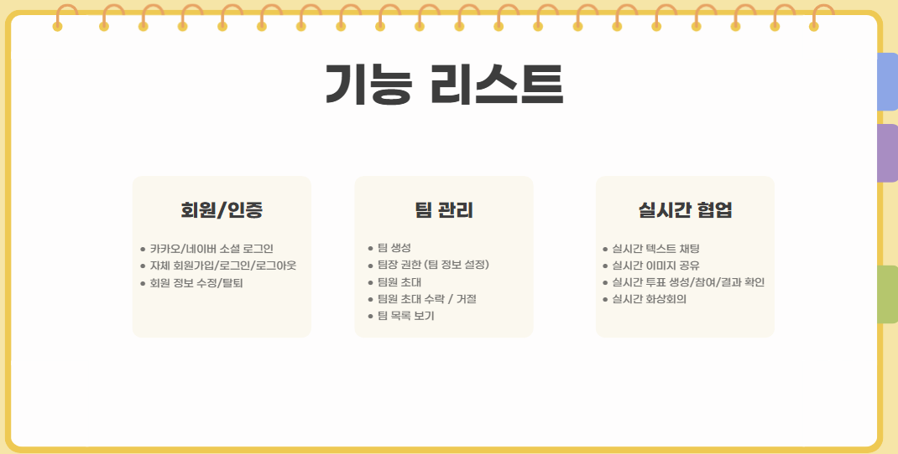

# CMM

  

## 🛠️ 프로젝트 개요

 

## ⚙️ 개발 환경

  <h4 style="margin: 0;">프론트엔드</h4>
  
  

  <h4 style="margin: 0;">백엔드</h4>
  
  
  
  
  
  

  <h4 style="margin: 0;">배포</h4>
  
  

  <h4 style="margin: 0;">협업툴</h4>
  
  
  

  <h4 style="margin: 0;">디자인</h4>
  
  

## 시스템 구성도
 

## ERD
 

## 주요기능
 
 
## UI
 

## 시연영상
<a href="https://youtu.be/aE4ufO2oBOs">@영상보기</a> 

## 🧑‍🎨 팀원 소개

|  |  |  |  |
|---|---|---|---|
|  **박수현** 팀장 / 프론트 <a href="https://github.com/park-soo-hyeon">@soo</a> |  **김규한** 풀스택 <a href="https://github.com/gyuhan0114">@gyu</a> |  **유현하** 백엔드 <a href="https://github.com/yoohyunha">@hyun</a> |  **임현** 백엔드 <a href="https://github.com/limhyun0319">@lim</a> |

## 느낀점
### 박수현
이번 졸업 작품 프로젝트에서 전반적인 진행과 UI 구성, 그리고 프론트엔드(React) 페이지 제작 및 API 연동 구현을 담당했습니다. 
리액트로 개발을 한다고 해서 리액트만 잘하면 되는 것이 아니라는 점을 깨달았고, 백엔드와의 소통이 얼마나 중요한지 직접 경험할 수 있었습니다. 처음에는 어떻게 진행해야 할지, 개발을 어떻게 시작해야 할지 막막했지만, 시간이 지나면서 점차 방법을 익혀 프로젝트를 성공적으로 마칠 수 있어 뿌듯했습니다. 직접 프로젝트를 진행하면서 개발 역량도 많이 성장했고, 많은 값진 경험을 쌓을 수 있었습니다.
 

### 김규한
이번 프로젝트를 통해 새로운 기술을 익히며 개발 역량이 향상되었고, 팀원들과의 협업이 얼마나 중요한지 깨달았다. 예상보다 어려운 부분들이 많았지만 함께 문제를 해결해나가며 큰 성취감을 느꼈다.
 

### 유현하
프로젝트를 하면서 처음에는 ERD설계와 데이터베이스 구조를 잡는게 쉽지 않았지만 데이터 흐름과 관계를 직접 고민해보는 과정이 재미있었습니다. Node.js로 실시간 서버를 구현하면서 텍스트, 투표, 이미지 등 다양한 데이터를 빠르고 안정적으로 처리하는 기술을 익혔고, 실시간 동기화의 복잡함을 직접 경험했습니다. 이러한 과정에서 서버와 클라이언트 간의 원활한 통신 구조를 설계하는 것을 배웠고 앞으로도 열심히 공부하며 구조와 흐름에 대해 익히고 싶은 계기가 되었습니다.
 

### 임현
이번 프로젝트에서 스프링부트를 활용해 백엔드를 맡아 회원 관리, 팀 프로젝트 관리, 네이버/카카오 로그인 API 구현을 담당했습니다. RESTful 아키텍처와 컨트롤러 구조를 설계하고 구현하면서 스프링 프레임워크에 대해 더 깊이 이해할 수 있었습니다. 사용자 등록, 인증 기능을 설계하면서 데이터베이스와의 연동, 그리고 데이터 모델링의 중요성을 다시 한 번 느꼈습니다. 특히 로그인 API 연동 과정에서는 외부 서비스와의 OAuth 인증, 보안 처리, 토큰 관리, 그리고 클라이언트-서버 간 데이터 통신 흐름을 더욱 명확하게 이해하게 되었습니다.
 

🐙 GitHub: <a href="https://github.com/DMU-CMM-Final" >@DMU_CMM_Final </a>  
🗂 Notion: <a href="https://www.notion.so/1adf95c37f3c809d8403e7917c7367fd? v=1adf95c37f3c814f83b7000cd48043a9&source=copy_link" target="_blank">@CMM</a> 

