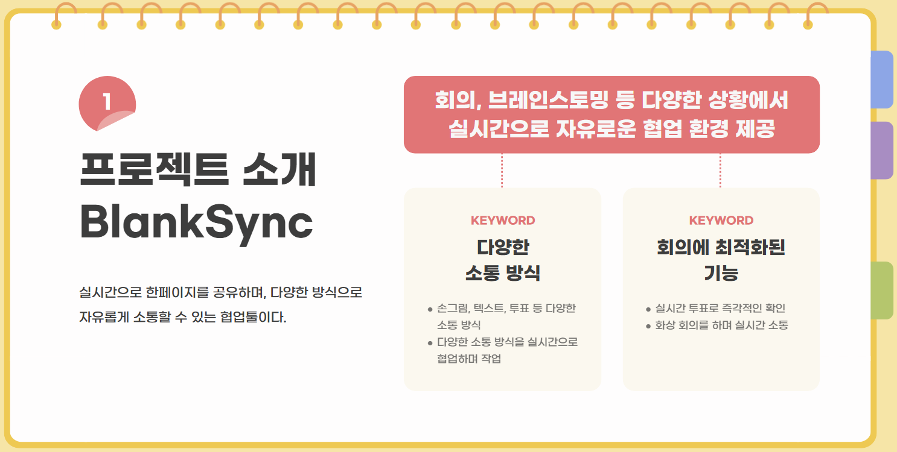
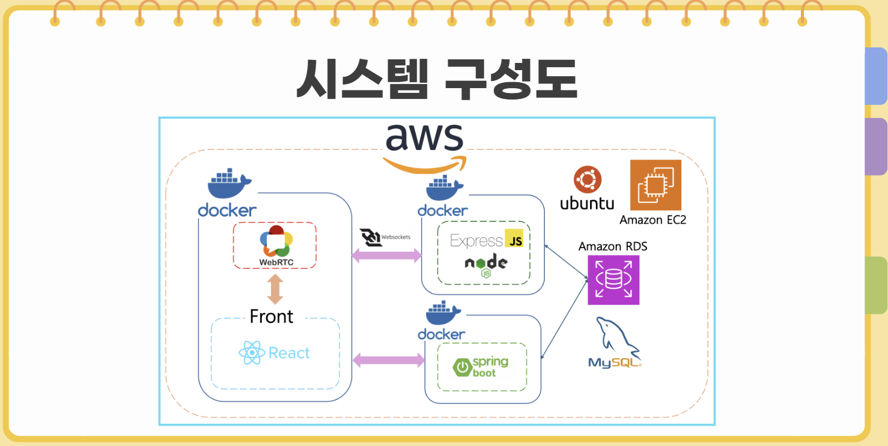
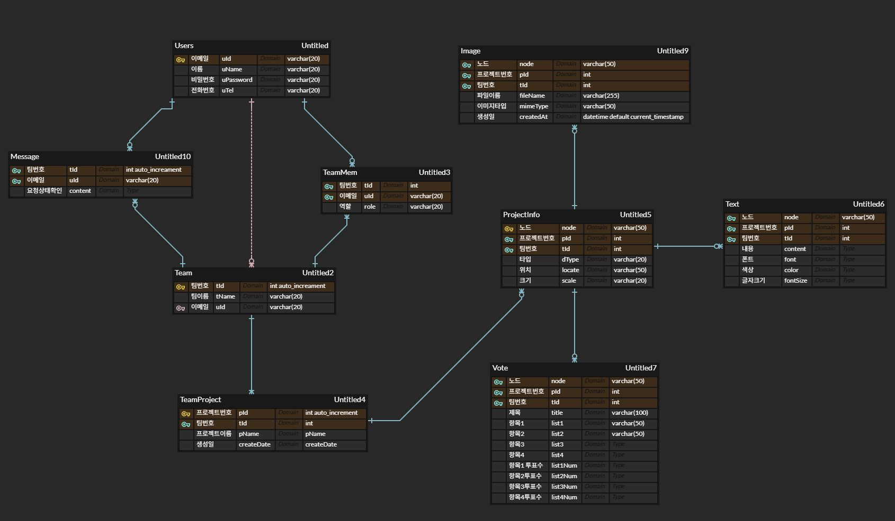

2025 동양미래대학교 컴퓨터소프트웨어공학과 CMM   
<a href="https://blanksync.o-r.kr/">

 </a>
# 실시간 원격 협업 플랫폼 BlankSync
  
  

    
  

## 🛠️ 프로젝트 개요

  

## ⚙️ 개발 환경

  <h4 style="margin: 0;">프론트엔드</h4>
  
  

  <h4 style="margin: 0;">백엔드</h4>
  
  
  
  
  
  

  <h4 style="margin: 0;">배포</h4>
  
  

  <h4 style="margin: 0;">협업툴</h4>
  
  
  

  <h4 style="margin: 0;">디자인</h4>
  
  

## 🔗 유사 서비스

## 🕸️ 시스템 구성도

 
 

## 🧬 ERD

 
 

## 👾 주요 기능

 
 
 

 
## 👀 UI

 
 

## 📅 개발 일정

## 🎬 시연 영상

  
     

## 👩‍💻🙌 팀원 소개

|  |  |  |  |
|---|---|---|---|
|  **박수현** 팀장 / 프론트 <a href="https://github.com/park-soo-hyeon">@soo</a> |  **김규한** 풀스택 <a href="https://github.com/gyuhan0114">@gyu</a> |  **유현하** 백엔드 <a href="https://github.com/yoohyunha">@hyun</a> |  **임현** 백엔드 <a href="https://github.com/limhyun0319">@lim</a> |

 

## 📢 느낀점
### 박수현
8개월이라는 긴 시간 동안 기획부터 복잡한 실시간 기술 구현, 그리고 배포까지 팀원들과 함께 성공적으로 완성할 수 있어 뜻깊었다. 
포기하지 않고 끊임없이 도전하고 소통하며 문제를 해결해 나간 과정 자체가 가장 큰 배움이었다. 
 

### 김규한
실시간 동기화의 복잡성 속세어 지연 시간을 극복하고 모두에게 '함께'라는 경험을 선사하는 짜릿함을 느꼈다. 사용자의 입력이 곧바로 화면에 반영되는 마법 같은 순간을 구현하며, 성능 최적화와 안정적인 연결의 중요성을 절감했다.
 

### 유현하
Node.js와 WebSocket을 활용하여 실시간 서버를 구현하면서 다양한 데이터를 빠르고 안정적으로 처리하는 기술을 익혔다. 
실시간 동기화의 복잡함을 경험했고 서버와 클라이언트 간의 원활한 통신 구조를 설계하는 것을 익혀 흥미로웠다.
 

### 임현
이번 프로젝트를 통해 서버 구조를 설계하고 유지보수 가능한 코드를 작성하는 것의 중요성을 알게되었다. Spring Security를 통해 인증/인가의 기본 원리를 이해했으며 AWS, Docker 배포와 API 테스트 과정을 통해 실제 서비스 운영 흐름을 익힐 수 있었다.
  

## 📩 자료 다운로드
**브로셔** : [brochure 다운로드](https://github.com/DMU-CMM-Final/.github/raw/refs/heads/main/profile/data/2025%20%EC%A1%B8%EC%97%85%EC%9E%91%ED%92%88%EC%A7%91_%EC%BB%B4%EC%86%8C_D_CMM.hwp) 
**포스터** : [poster 다운로드](https://github.com/DMU-CMM-Final/.github/raw/refs/heads/main/profile/data/poster.pptx) 
**프로젝트 계획서** : [계획서 다운로드](https://github.com/DMU-CMM-Final/.github/blob/main/profile/data/%EC%B5%9C%EC%A2%85%EB%B3%B4%EA%B3%A0%EC%84%9C_CMM_%EC%8B%A4%EC%8B%9C%EA%B0%84%ED%98%91%EC%97%85%ED%94%8C%EB%9E%AB%ED%8F%BC(BlankSync).pdf) 
**프론트 코드** : [front](https://github.com/DMU-CMM-Final/front) 
**노드서버 코드** : [node](https://github.com/DMU-CMM-Final/node) 
**스프링서버 코드** : [spring](https://github.com/DMU-CMM-Final/spring) 
  

🐙 GitHub: <a href="https://github.com/DMU-CMM-Final" >@DMU_CMM_Final </a>  
🗂 Notion: <a href="https://www.notion.so/1adf95c37f3c809d8403e7917c7367fd? v=1adf95c37f3c814f83b7000cd48043a9&source=copy_link" target="_blank">@CMM</a> 

