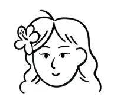

# CMM

  

## 🛠️ 프로젝트 개요
 

## 🧑‍💻 프로젝트 소개
 

## ⚙️ 개발 환경

  <h4 style="margin: 0;">프론트엔드</h4>
  
  

  <h4 style="margin: 0;">백엔드</h4>
  
  
  

  <h4 style="margin: 0;">배포</h4>
  
  

  <h4 style="margin: 0;">협업툴</h4>
  
  
  

  <h4 style="margin: 0;">디자인</h4>
  
  

## 시스템 구성도
 

## ERD
 

## 주요기능
 

## 시연영상
 

## ERD
 

## 🧑‍🎨 팀원 소개

|  |  |  |  |
|---|---|---|---|
|  **박수현** 팀장 / 프론트 <a href="https://github.com/park-soo-hyeon">@soo</a> |  **김규한** 풀스택 <a href="https://github.com/gyuhan0114">@gyu</a> |  **유현하** 백엔드 <a href="https://github.com/yoohyunha">@hyun</a> |  **임현** 백엔드 <a href="https://github.com/limhyun0319">@lim</a> |

## ⚙️ 흠
🐙 GitHub: <a href="https://github.com/DMU-CMM-Final" >@DMU_CMM_Final </a>  
🗂 Notion: <a href="https://www.notion.so/1adf95c37f3c809d8403e7917c7367fd? v=1adf95c37f3c814f83b7000cd48043a9&source=copy_link" target="_blank">@CMM</a> 
🌐 배포 링크: https://blancksync.example.com

## 느낀점
**박수현**
**김규한**
**유현하**
**임현**

